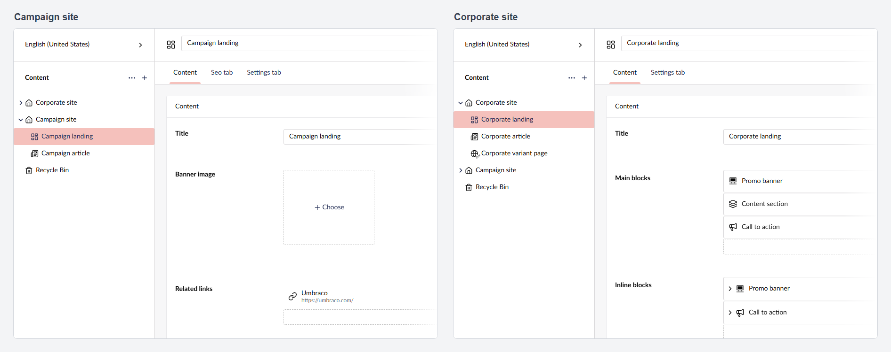
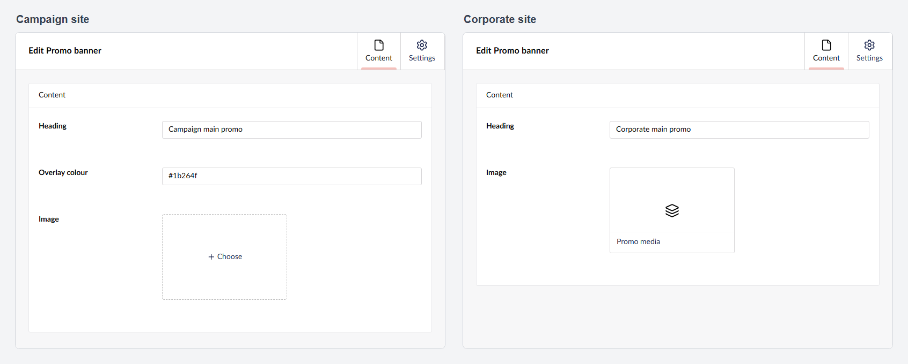
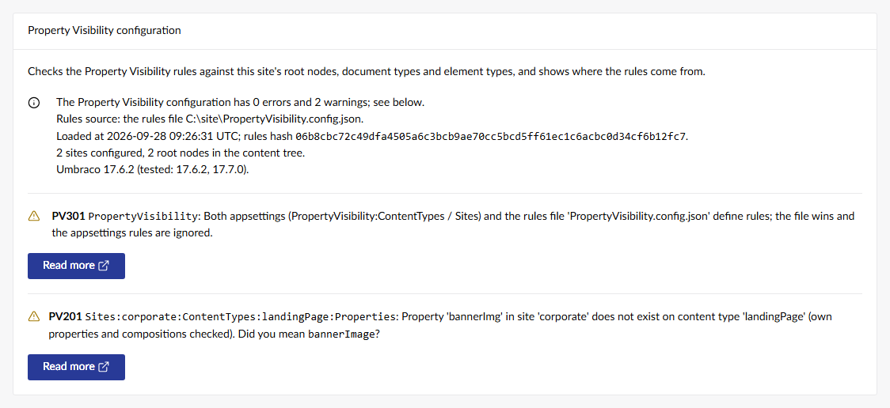

# Property Visibility

Hide properties, groups and tabs per site in the Umbraco backoffice.

[](https://www.nuget.org/packages/Umbraco.Community.PropertyVisibility)
[](LICENSE)

## What it does

When several sites in one Umbraco installation share a document type, some of its fields often matter on one site only. Property Visibility hides those fields from editors, per site, without a second document type.

- Hides properties, tabs (with every group and property in them) and groups, by alias, per document type or element type.
- Rules apply on every site, or on one site. A site is a root node, identified by its key, its name, or as the default site.
- The same rules work inside blocks: Block List, Block Grid, Single Block and blocks in the rich text editor, for the content and the settings of a block.
- Rules live in appsettings or in a separate JSON file, reload without a restart, and come with JSON schemas for IntelliSense.
- A health check reports every root node, site or alias in the rules that does not resolve, with stable issue codes.
- Hidden values are kept: a hidden property keeps its value through save, publish and reload.

It changes what editors see, not what they are allowed to do. Read [What it does not do](#what-it-does-not-do) before you rely on it.

## Screenshots



_One document type on two sites: the Seo tab, the banner image and the related links only where they are needed._



_Blocks follow the site of the document that holds them: the promo banner's overlay colour is hidden on Corporate site only._



_The health check reports rules that do not resolve, with an issue code and a suggested fix._

## Install

```
dotnet add package Umbraco.Community.PropertyVisibility --prerelease
```

Until 1.0.0 ships, every release is a prerelease (`1.0.0-rc.*`), so `--prerelease` is needed. The package needs Umbraco 17.6.2 or a later 17.x on .NET 10 (see [Supported Umbraco versions](#supported-umbraco-versions)). It registers itself through a composer, so there is no startup code to add, and without rules it hides nothing. Build the site once after installing: the build copies the JSON schemas that give IntelliSense for the configuration.

To try it on a new site, create that site from the 17.x templates (`dotnet new install Umbraco.Templates::17.7.0`). The current default templates create an Umbraco 18 site, where the install reports `NU1107` and the next restore fails; do not work around that error, because 1.x does not run on Umbraco 18.

## Quick start

For a single site, add a `PropertyVisibility` section to `appsettings.json`, next to the existing `Umbraco` section, and replace the example aliases with your own:

```json
{
  "PropertyVisibility": {
    "ContentTypes": {
      "landingPage": { "Containers": ["seoTab"], "Properties": ["relatedLinks"] },
      "promoBanner": { "Properties": ["overlayColour"] }
    }
  }
}
```

Save the file (no restart needed) and reopen a document in the backoffice. On every `landingPage` the `seoTab` tab and the `relatedLinks` property are gone, and in every `promoBanner` block the `overlayColour` property is gone.

- The keys under `ContentTypes` are content type aliases: document types, and element types for blocks.
- `Properties` lists property aliases, including properties that come from a composition.
- `Containers` lists tab and group aliases: `seoTab` hides a tab with everything in it, `settingsTab/advanced` hides one group inside a tab, and a group alias on its own hides a group that is not inside a tab.
- The backoffice does not show tab and group aliases. Umbraco derives them from the name in camelCase ("Seo tab" becomes `seoTab`), and the tab's URL segment (`seo-tab`) is not the alias. For a container alias that does not exist, the health check's `PV202` lists every `tab` and `tab/group` alias of the type.
- Aliases are matched case-insensitively. An alias that does not exist hides nothing and shows up in the health check: `PV104` for a content type, `PV201` for a property, `PV202` for a tab or group.

## Multi-site and the rules file

`Sites` adds rules for one site. The top-level `ContentTypes` keep applying on every site.

```json
{
  "PropertyVisibility": {
    "ContentTypes": {
      "siteSettings": { "Containers": ["legacyTab"] }
    },
    "Sites": {
      "corporate": {
        "RootNodeKey": "5c2b4d7e-9f1a-4c3e-8b6d-2a1f0e9d8c7b",
        "ContentTypes": {
          "landingPage": { "Properties": ["bannerImage", "relatedLinks"], "Containers": ["seoTab", "settingsTab/advanced"] },
          "promoBanner": { "Properties": ["overlayColour"] }
        }
      },
      "campaign": {
        "RootNodeName": "Campaign site",
        "ContentTypes": {
          "landingPage": { "Properties": ["metaKeywords"] }
        }
      },
      "everythingElse": {
        "IsDefault": true,
        "ContentTypes": {
          "landingPage": { "Properties": ["bannerImage"] }
        }
      }
    }
  }
}
```

The site label (`corporate`, `campaign`, ...) is free text (without `:`) that appears in diagnostics. Each site names its root node with `RootNodeKey` (recommended: it survives renames), `RootNodeName`, or `IsDefault` for every root that no other site matches.

The rules can live in one of two places:

| | appsettings (section `PropertyVisibility`) | Rules file (`PropertyVisibility.config.json`) |
|---|---|---|
| Holds | every option | `ContentTypes`, `Sites` and `HideEmptiedContainers` |
| Where | any .NET configuration source: `appsettings.json`, `appsettings.{Environment}.json`, environment variables | the content root, next to `appsettings.json`; another path with the `ConfigFile` option |
| When both define rules | ignored; `PV301` warns | wins |
| A broken edit | a value that cannot be bound or fails validation: nothing is hidden until it is fixed (`PV008`); invalid JSON in `appsettings.json` is handled by .NET configuration, not by this package | invalid JSON or an unknown key keeps the last valid version (`PV001`, `PV002`); rules that fail validation hide nothing (`PV008`) |
| Reload | on save, no restart | on save, no restart |

When the rules file exists and is valid, its `ContentTypes` and `Sites` replace the appsettings ones as a whole: nothing is merged. `Enabled` (the kill switch) and `ConfigFile` can only be set in appsettings. On Docker bind mounts, volumes and network shares, file change events may not arrive; set `DOTNET_USE_POLLING_FILE_WATCHER=1` so edits to the rules file are picked up. A rules file that is a symbolic link (a Kubernetes ConfigMap or Secret, or a link into a shared folder) is not reloaded by the default watcher either, and nothing reports it: point `ConfigFile` at the real file, or set `DOTNET_USE_POLLING_FILE_WATCHER=1`. When the file cannot be watched at all, the health check shows `PV304`.

The package ships a JSON schema for each place. After the first build, editors that follow the `"$schema": "appsettings-schema.json"` line of the Umbraco template (Visual Studio, VS Code, Rider) complete and check the `PropertyVisibility` section. Start a rules file with `"$schema": "./PropertyVisibility.config-schema.json"`; the build copies that schema next to it. The copies are build output: add `PropertyVisibility.config-schema.json` to the site's `.gitignore`, which already ignores `appsettings-schema*.json`.

Every option, the alias grammar and the reload rules: [docs/configuration.md](docs/configuration.md).

## Matching rules

For each document the package finds the root node (the document's top-level ancestor; for a document that is not saved yet, the root of the parent it is created under) and picks one site:

| Order | The site that matches | Notes |
|---|---|---|
| 1 | the site whose `RootNodeKey` is the root's key | Recommended. A renamed root keeps matching, and `PV105` reports a `RootNodeName` that no longer agrees. |
| 2 | the site whose `RootNodeName` is the root's name | Case-insensitive and trimmed. On a culture-variant root: the default-culture name as of the last save. |
| 3 | the site with `IsDefault: true` | At most one site. |
| 4 | no site | Only the top-level `ContentTypes` apply. |

A document created at the content root has no root before its first save, so it gets the default site; after the save it is its own root. Documents in the recycle bin match no site, not even the default one, and get the top-level rules only.

The rules for a document or a block are the union of the top-level `ContentTypes` entry and the matched site's entry for its content type and for each of its compositions. Hiding only adds up: no rule can show what another rule hides. With `HideEmptiedContainers` (on by default), a group whose properties are all hidden disappears too, and so does a tab whose own properties and groups are all hidden.

Compositions: a rule keyed by a composition applies wherever the composition is used, to the composition itself and to every document or element type composed of it, directly or through another composition. A parent document type counts as a composition. The rule resolves against the composition's own properties, tabs and groups, so `"siteSettings": { "Containers": ["legacyTab"] }` removes the Legacy tab that `siteSettings` contributes, but not a tab with the same alias that the composing type defines itself. To hide something on one composing type only, key the rule by that type. The health check lists the types each composition rule reaches (`PV205`). Details: [docs/configuration.md](docs/configuration.md#compositions).

## Blocks

Rules keyed by an element type apply inside blocks, for the site of the document that holds the block. A block's content follows the rules of its content element type, its settings the rules of its settings element type:

```json
"corporate": {
  "RootNodeKey": "5c2b4d7e-9f1a-4c3e-8b6d-2a1f0e9d8c7b",
  "ContentTypes": {
    "promoBanner": { "Properties": ["overlayColour"] },
    "promoBannerSettings": { "Properties": ["anchorId"] }
  }
}
```

Covered by the acceptance suite on Umbraco 17.6.2 and 17.7.0: Block List in a modal and inline, Block Grid in a modal, blocks inside blocks (two levels deep), blocks in a document that is not saved yet, and blocks in a culture-variant document in split view. Checked by hand on both versions: Single Block in a modal and inline, blocks in the rich text editor, and blocks pasted from the clipboard into another site's document (they follow the site they are pasted into).

Where it does not apply:

- Blocks edited outside a document: nothing is hidden in a media item, a member or a document blueprint, also when the media item or member is opened from inside a document.
- Block Grid inline editing: the property the grid renders inline (the element type's first property) is always shown. The block's modal still hides it.
- A block label that uses a hidden property still shows its value.

Details: [docs/configuration.md](docs/configuration.md#blocks).

## Health check and issue codes

Settings > Health Check > Configuration > "Property Visibility configuration" checks the rules against the site it runs on:

- a `RootNodeKey` that is not a root node, a `RootNodeName` that matches no root, and a root that no site matches;
- a content type, property or container alias that does not exist, with a "Did you mean" suggestion or the list of the type's tab and group aliases;
- hidden properties that are mandatory (`PV203`);
- configuration errors: invalid JSON or an unknown key in the rules file, a site without an identity, two sites for one root, more than one default site;
- a summary with the rules source, when the rules were loaded, a rules hash to compare servers, and the Umbraco version against the tested versions.

Every issue has a stable code (`PV001` to `PV304`) whose meaning never changes. The same issues are written to the server log once per configuration change, never per request. Every code is explained in [docs/configuration.md](docs/configuration.md#issue-codes).

## Debug flag and the applied event

To see what the package does in the backoffice, run this in the browser console:

```js
localStorage['Umbraco.Community.PropertyVisibility.Debug'] = '1'
```

Every hidden-fields response and every completed pass is then logged at the Verbose level with the prefix `[PropertyVisibility]`: the matched site and why it matched, the warnings, and how many properties, tabs and groups were hidden. Remove the key to stop. The log never adds the key or name of the document's site root; when the open document is itself a root node, its own key is logged as the document key.

After every completed pass the backoffice dispatches `umbraco-community-property-visibility:applied` on `window`, with `documentKey`, `contentTypeKey`, `propertyCount`, `containerCount` and `target` (`document`, `block-content` or `block-settings`). It is a stable integration point for tests and other packages. Details: [docs/configuration.md](docs/configuration.md#debugging-in-the-browser).

## Supported Umbraco versions

| Umbraco | Status |
|---|---|
| 17.6.2 | Verified, the lowest supported version |
| 17.7.0 | Verified |
| 17.0 to 17.6.1 | Not supported: the package relies on backoffice APIs verified from 17.6.2 on |
| 18 | Not supported yet, see [Upgrading to Umbraco 18](#upgrading-to-umbraco-18) |

The package depends on Umbraco `[17.6.2, 18.0.0)` and .NET 10. A later 17.x can be installed; until it is verified here, the health check reports it as `PV303` (Info). What each verification covered: [docs/compatibility.md](docs/compatibility.md).

## What it does not do

- **It is not authorization.** Hiding is a backoffice user-interface feature. Hidden values stay in the document: they are loaded into the browser, saved with the document unchanged, readable and writable through the Management API, returned by the Delivery API and rendered on the website as before. To restrict who may read or change a property, use Umbraco's user group permissions (Document Property Value permissions, see [Users in the Umbraco documentation](https://docs.umbraco.com/umbraco-cms/manage-and-publish-content/users-and-members/users)).
- **Hidden mandatory properties still block publishing.** Umbraco saves the document and reports that it could not be published, but shows no hint on the hidden field, so the editor cannot see why. The health check warns about every hidden mandatory property (`PV203`).
- **No rules per user group.** Every user sees the same result. Umbraco's property permissions on user groups cover that.
- **No rules per culture or segment.** A hidden property is hidden in every language.
- **No rules per subtree or per document.** A site is a root node and everything under it.
- **No media types or member types.** Rules apply to documents and to blocks in documents. Document blueprints hide nothing.
- **Blocks outside documents get nothing hidden**: blocks in media items, members and document blueprints, also when those are opened from inside a document.
- **Block Grid inline editing shows a block's first property** regardless of the rules, because Umbraco renders it without the property view guard. The block's modal hides it.
- **Block labels can show hidden values**: a label template that uses a hidden property still shows it.
- **Only the document and block editors change.** Collection (list view) columns, the content tree, search, preview and the website show hidden properties as before.
- **No per-site property editor configuration.** The package does not change labels, descriptions, the order of properties or tabs, data type settings, or the block types a property allows.
- **Tabs and groups are removed through an Umbraco API that is not a documented extension point.** Umbraco has a view guard for properties but none for tabs and groups, so the package removes them from the workspace's in-memory structure (`removeContainer`). Each Umbraco minor is re-verified before it is listed as supported. If a version drops that method, properties stay hidden, the emptied tabs and groups stay visible, and the backoffice shows one warning.
- **A content type whose every property is hidden keeps its Content view.** The view shows no fields; when every tab and group was removed, it shows Umbraco's "Not found" message after a few seconds.
- **Hidden fields can show for a moment.** The rules arrive with a request the backoffice sends when a document or block opens, so its fields can render for that one round trip before they are hidden.
- **Rule changes reach a document when it is opened again.** An open document, and the blocks in it, keep the rules they were opened with.
- **A document type changed while a document is open does not reach that document** once a tab or group was hidden in it. Reopen the document.
- **Name matching on culture-variant roots uses the default-culture name as of the last save.** Use `RootNodeKey` where you can.
- **No per-site rules in the recycle bin.** A trashed document matches no site, not even the default one; only the top-level `ContentTypes` apply until it is restored.
- **Errors never hide more.** Rules that cannot be read or fail validation (`PV008`), a failed request or an unknown content type hide nothing; a broken edit of the rules file keeps the last valid version. When the package's request fails, the backoffice shows one Property Visibility warning until the page is reloaded, instead of Umbraco's generic error notification on every document.
- **Umbraco 17 only**, from 17.6.2.

## Known upstream issues

- Discussion [#16329](https://github.com/umbraco/Umbraco-CMS/discussions/16329): Umbraco's property-level permissions do not cover tabs and groups. This is why the package uses `removeContainer` (see above) and why each Umbraco minor is re-verified.
- Discussion [#20538](https://github.com/umbraco/Umbraco-CMS/discussions/20538): a tab whose properties are all hidden by a view guard stays visible in Umbraco. For its own rules the package removes such tabs and groups (`HideEmptiedContainers`).
- Issue [#21253](https://github.com/umbraco/Umbraco-CMS/issues/21253): a guard rule added as soon as a workspace context appears can be missed. The package adds its rules after its own request returns, and the acceptance suite has not shown the problem.
- Issue [#21254](https://github.com/umbraco/Umbraco-CMS/issues/21254): Umbraco's write guard (read-only properties) does not stop pickers and block editors. The package only uses view guards; a read-only mode would depend on this issue.
- On Umbraco 17.6.2 and 17.7.0 an inline-edited Block List item that is re-rendered while it initializes throws "Context request was cancelled, host was disconnected" as an uncaught promise rejection in the browser console, most often after a click on the already selected Content tab while the page loads. It was reproduced on a stock 17.6.2 site without this package on 2026-09-25 (counts in [docs/testing.md](docs/testing.md#manual-acceptance-runs)); the same code is unchanged in 17.7.0.

## Upgrading to Umbraco 18

Not yet. 1.x supports Umbraco 17 only and declares `[17.6.2, 18.0.0)`. Umbraco 18 support is planned as a 2.0 release, because Umbraco 18 changes backoffice and API registration details that 1.x relies on. To move a site to Umbraco 18 before 2.0 exists, remove the package first. It stores nothing in the database, so removing it only makes the hidden fields visible again; keep the `PropertyVisibility` section or the rules file for later.

## Support and maintenance

Property Visibility is an actively maintained community package.

- 1.x follows Umbraco 17, a long-term support release. A new 17.x minor is listed under [Supported Umbraco versions](#supported-umbraco-versions) once it has passed the checks in [docs/compatibility.md](docs/compatibility.md); `compat.yml` runs the automated part against the latest 17.x every week.
- Umbraco 18 support is planned as 2.0, without a date (see [Upgrading to Umbraco 18](#upgrading-to-umbraco-18)).
- Bugs and questions go in [GitHub issues](https://github.com/erwindamsma/Umbraco.Community.PropertyVisibility/issues). Report security issues privately, see [SECURITY.md](SECURITY.md).

## Alternatives

Umbraco itself and other packages cover related needs:

- **Per user group instead of per site**: Umbraco's Document Property Value permissions on user groups (properties only), or [Umbraco.Community.AdminOnly](https://www.nuget.org/packages/Umbraco.Community.AdminOnly), which hides document types, tabs, properties and tree nodes from users who are not administrators.
- **Depending on the value of another property** in the same document type: [Our.Umbraco.ConditionalDisplayers](https://www.nuget.org/packages/Our.Umbraco.ConditionalDisplayers).
- **The same properties hidden on every site, managed in a dashboard**: [Our.Umbraco.BlockFieldVisibility](https://www.nuget.org/packages/Our.Umbraco.BlockFieldVisibility) hides properties of a page type or a Block List block type wherever that type is used.

Property Visibility fits when several sites share document or element types and properties, tabs or groups should disappear on some of those sites.

## Contributing

Issues and pull requests are welcome, see [CONTRIBUTING.md](CONTRIBUTING.md). Building from source needs the .NET 10 SDK and Node 24 LTS (24.13 or later). `dotnet build Umbraco.Community.PropertyVisibility.slnx` builds the package, its backoffice client and the test site (skip the client with `-p:SkipClientBuild=true`); `dotnet run --project src/Umbraco.Community.PropertyVisibility.TestSite --launch-profile https` starts the test site on https://localhost:44300/umbraco. Tests are described in [docs/testing.md](docs/testing.md). Report security issues privately, see [SECURITY.md](SECURITY.md).

## Licence

[MIT](LICENSE). Third-party code in the repository and in the package, with its licence: [THIRD-PARTY-NOTICES.md](THIRD-PARTY-NOTICES.md).

Property Visibility is a community package. It is not made, endorsed or supported by Umbraco A/S. Umbraco is a trademark of Umbraco A/S.
